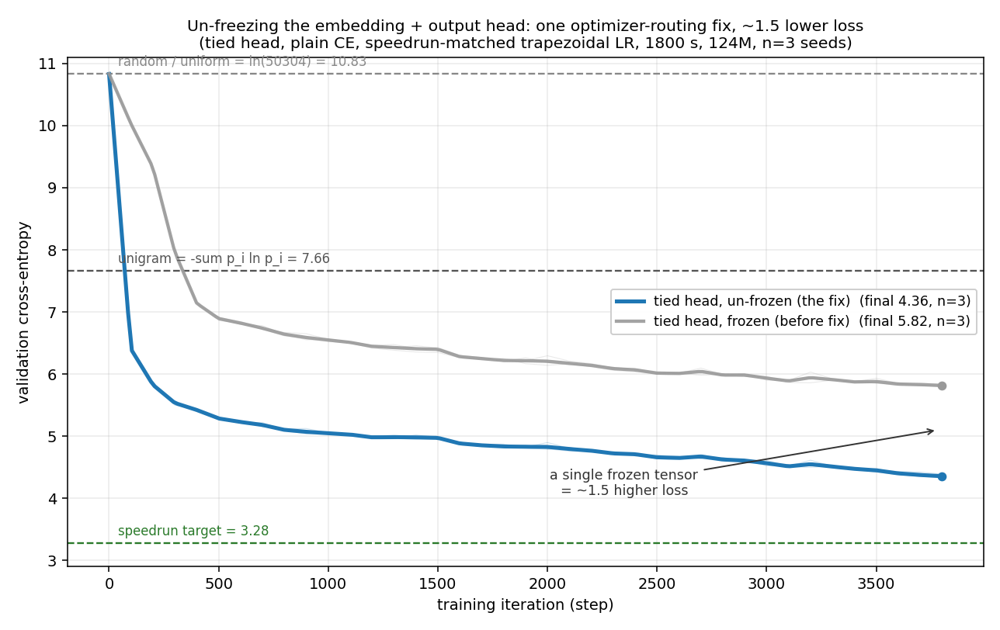

# nanogpt-1gpu

A **single-GPU adaptation of the [modded-nanogpt](https://github.com/KellerJordan/modded-nanogpt) speedrun**, for local experimentation, architecture screening, and learning. The speedrun trains a 124M GPT on FineWeb to 3.28 validation loss as fast as possible on 8×H100; most people can't rent 8×H100. This is a faithful-where-it-can-be re-implementation that runs on **one consumer GPU (16 GB)**, with a methodology built to keep the results trustworthy.

**This is a research *harness*, not a benchmark** — a tool I use to decide what's worth validating on the real thing, not a stable reference for others to adopt. Absolute numbers here do not transfer to the record; the value is in the rankings and the method.

**Lineage & credit.** This descends from Andrej Karpathy's [nanoGPT](https://github.com/karpathy/nanoGPT) / [llm.c](https://github.com/karpathy/llm.c) (the target and the original code lineage) and from Keller Jordan and the modded-nanogpt contributors (the speedrun architecture and the Muon/NorMuon optimizer). Their work is the foundation; see `LICENSE`. The single-GPU harness, the methodology, the results, and the bug log are mine.

---

## The headline result: an architecture search that found a bug

I went looking for architectural improvements. The finding is that **the standard architecture was right**, and the one real improvement I found was **fixing a bug that had been masquerading as a result**:

- Chasing a weak output head, I added a fixed log-unigram bias to the logits and measured what looked like a large win (−0.68, dead-consistent across seeds and budgets). I had it written up.
- Auditing the optimizer, I found the cause: the tied token-embedding and output head had been **excluded from the optimizer and frozen at initialization** for every full-architecture run. (PyTorch deduplicates a tied weight to one name; the routing skipped that name, expecting the other — deduplicated-away — name to carry it.)
- **Fixing it improved the baseline by ~1.5** (5.82 → 4.36), larger than any architecture change — and **retracted my own headline**: on a head that can actually learn, the unigram bias does nothing (+0.01). Giving the head *more* freedom (low-rank offset, full untie) only hurts at this budget — tying is a sample-efficiency prior.



The durable asset isn't an architecture — it's the methodology and the trail that caught it. The full account of every bug and confound is in **[BUGLOG.md](BUGLOG.md)**.

## Methodology (the point of the repo)

Cheap, sharp checks that keep a fast screening loop trustworthy:

- **Beat the unigram floor.** A run only counts if it beats a context-free unigram model (`−Σ pᵢ ln pᵢ` ≈ 7.66 here; random is `ln(50304)` ≈ 10.83). Below 7.66 the model isn't using context and the comparison is meaningless.
- **Every weight must change during training.** Snapshot params, train K steps, assert nothing trainable is unchanged — and assert every trainable param is in the optimizer. (Either check catches the frozen-head bug above on day one.)
- **Paired comparisons.** Same seed for variant and baseline; test the per-seed differences, not group means.
- **Matched hyperparameters.** Tune the learning rate per variant before believing an architecture win (an LR confound faked one early on).
- **Budget stability.** Re-run apparent winners at longer budgets; early leads often fade.

## What was actually found

- **Activations (valid).** Rankings flip with the optimizer: gated MLPs win under AdamW, lose under Muon; `sniqu`, a zero-mean activation I designed, wins under Muon (the *normalization*, not the shape, is what helps). AdamW rewards expressivity, Muon rewards conditioning.
- **Convolutional local mixing (null).** A depthwise conv alongside attention is redundant with attention + RoPE here.
- **Head freedom (null/negative).** Tied + un-frozen beats low-rank offset beats full untie at this budget.

## How it differs from the speedrun

| | |
|---|---|
| **Output head** | *simplified* — plain tied head + plain CE (the record unties at 2/3 + softcaps). The thing that mattered was just *training* the tied head. |
| **LR schedule** | *matched* — trapezoidal/WSD (constant, then linear cooldown to 0.15× over the last 60%). |
| **Attention / precision** | *changed (hardware)* — SDPA instead of FlashAttention-3, bf16 instead of FP8. |
| **Batch / seq-len schedules** | *fixed* — the record's batch sizes need 8×H100; its seq-len schedule is tied to FA3 windowing. |
| **Scale** | one GPU (16 GB) vs 8×H100, shorter budgets. |

## Quickstart

```bash
python data/cached_fineweb10B.py 9          # download ~900M training tokens
python harness.py --config speedrun --compile --plain-ce \
                  --batch-size 12 --max-seconds 1800 --seeds 3 --out results/run.json
```

## Status

The harness works and the results above are current, but the code is mid-cleanup: it carries a large experimental surface and a legacy-topology layer from its fork origins. The optimizer-routing fix (which makes the frozen-weight bug structurally impossible) is already in; a module split and a triage of the experimental flags are planned, gated on reproducing the corrected baseline on the slimmed code.
